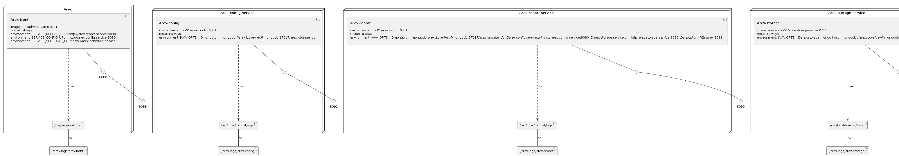

AREX: Real automated API testing with real data. [AREX Handbook](https://arextest.github.io/arex-doc/index.html)

## AREX install  
AREX provide docker-compose.yml to install with docker compose.

```
git clone https://github.com/arextest/deployments.git
cd deployments
docker-compose up -d
```  
### Query AREX services status  

Then, you could query the arex services such as    

```
[~ deployments]# docker-compose ps
    Name                   Command               State                 Ports              
------------------------------------------------------------------------------------------
arex-config     catalina.sh run                  Up      0.0.0.0:8091->8080/tcp           
arex-front      docker-entrypoint.sh node  ...   Up      0.0.0.0:8088->8080/tcp           
arex-mongodb    docker-entrypoint.sh --auth      Up      0.0.0.0:27017->27017/tcp         
arex-mysql      docker-entrypoint.sh mysqld      Up      0.0.0.0:3306->3306/tcp, 33060/tcp
arex-redis      docker-entrypoint.sh --app ...   Up      0.0.0.0:6379->6379/tcp           
arex-report     catalina.sh run                  Up      0.0.0.0:8090->8080/tcp           
arex-schedule   catalina.sh run                  Up      0.0.0.0:8092->8080/tcp           
arex-storage    catalina.sh run                  Up      0.0.0.0:8093->8080/tcp  
```
## AREX multi-instance install 
AREX provide docker-compose-distribute.yml to install with docker compose.

```
git clone https://github.com/arextest/deployments.git
cd deployments
docker-compose -f docker-compose-distribute.yml up -d
```  
### Query AREX services status  

Then, you could query the arex services such as    

```
[~ deployments]# docker-compose  -f docker-compose-distribute.yml ps
    Name                   Command               State                 Ports              
------------------------------------------------------------------------------------------
arex-config      catalina.sh run                  Up      0.0.0.0:8091->8080/tcp           
arex-front       docker-entrypoint.sh node  ...   Up      0.0.0.0:8088->8080/tcp           
arex-mongodb     docker-entrypoint.sh --auth      Up      0.0.0.0:27017->27017/tcp         
arex-mysql       docker-entrypoint.sh mysqld      Up      0.0.0.0:3306->3306/tcp, 33060/tcp
arex-redis       docker-entrypoint.sh --app ...   Up      0.0.0.0:6379->6379/tcp           
arex-report      catalina.sh run                  Up      0.0.0.0:8090->8080/tcp           
arex-schedule1   catalina.sh run                  Up      0.0.0.0:10092->8080/tcp          
arex-schedule2   catalina.sh run                  Up      0.0.0.0:11092->8080/tcp          
arex-storage1    catalina.sh run                  Up      0.0.0.0:10093->8080/tcp          
arex-storage2    catalina.sh run                  Up      0.0.0.0:11093->8080/tcp          
schedule-nginx   /docker-entrypoint.sh ngin ...   Up      80/tcp, 0.0.0.0:8092->8080/tcp   
storage-nginx    /docker-entrypoint.sh ngin ...   Up      80/tcp, 0.0.0.0:8093->8080/tcp   
```


### Infrastructure model

