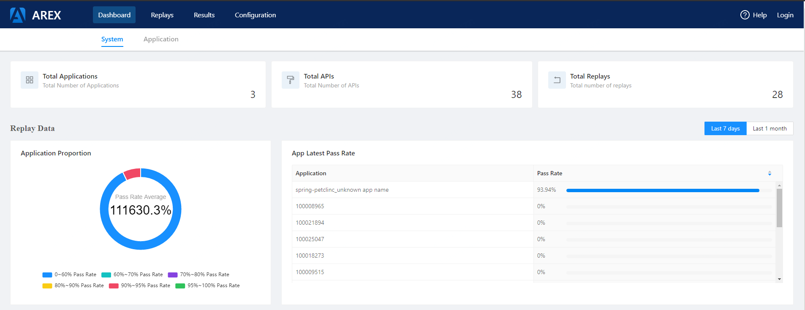

# ArexTest documentation

## What's new

areXTest is changing all the time. For release highlights checkout links below, if you want a complete list of every change, as well as info on deprecations, breaking changes and plugin development read the release notes.

### arexTest 1.0

- What's new in 1.0

## Introduction to areXTest

AREX: AREX is a “Differential Testing” and “Record and Replay Testing” Tool:

- Test restful API by record, replay and stub request/response
- Differential testing known as differential fuzzing, is a popular software testing technique that attempts to detect bugs, by providing the same input to a series of similar applications and observing differences in their execution.

### Why AREX?

- AREX finds potential bugs in your service using running instances of your new code and your old code side by side.
  - AREX behaves as a proxy and multicasts whatever requests it receives to each of the running instances.
  - It then compares the responses, and reports any regressions that may surface from those comparisons.
  - The premise for AREX is that if two implementations of the service return “similar” responses for a sufficiently large and diverse set of requests, then the two implementations can be treated as equivalent and the newer implementation is regression-free
- Regression testing is an important stage of testing and an important means to ensure quality
  - Automated regression testing has high use case maintenance costs
  - The data of automated testing is difficult and the time cost is high
  - Fully automatic construction of use cases, automatic recording of interface data in production requests and processing, and automatic construction of test requests and stub data
  - During regression testing, interface requests are automatically played back, and response packets are parsed
  - Automatically compare the results, analyze the differences intelligently, and display the differences one by one
  - Continuous accumulation of regression test cases

### arexTest Open Source

### arexTest Cloud

### arexTest Enterprise

## Getting started

### Features

- Fully automatic recording of requests, internal requests and responses without human intervention
- Fully automatic difference comparison, automatically generate report
- Accumulate test cases to make regression test coverage close to 100%

#### Record

- The minimum range for recording is one RESTFul interface URL
- The TraceID is key field of APM-based that recording and playback, data storage in Mongodb
- All use cases belonging to this interface include all TraceID requests + responses + Stub data under this interface URL

#### Replay

- The traceid is the smallest unit when Regression Testing execute
- In line with the playback target, all matching records can be played back, or some test cases can be filtered out by adding a time range

#### Stub

- stub inner request/response

## areXTest basics

### areXTest config

### arexTest schedule

## Best practices

## Authentication

## Installation

## Administration

## Operations

### areXTest Dashboard

dashboard

## Permissions

## Troubleshooting

## Developers

## Release notes

## API Reference

## Copyright notice
