# ArexTest documentation

## What's new

areXTest is changing all the time. For release highlights checkout links below, if you want a complete list of every change, as well as info on deprecations, breaking changes and plugin development read the release notes.

### arexTest 1.0

- What's new in 1.0

## Introduction to areXTest

AREX: AREX is a “Differential Testing” and “Record and Replay Testing” Tool:

- Test restful API by record, replay and stub request/response
- Differential testing known as differential fuzzing, is a popular software testing technique that attempts to detect bugs, by providing the same input to a series of similar applications and observing differences in their execution.

### Why AREX?

- AREX finds potential bugs in your service using running instances of your new code and your old code side by side.
  - AREX behaves as a proxy and multicasts whatever requests it receives to each of the running instances.
  - It then compares the responses, and reports any regressions that may surface from those comparisons.
  - The premise for AREX is that if two implementations of the service return “similar” responses for a sufficiently large and diverse set of requests, then the two implementations can be treated as equivalent and the newer implementation is regression-free
- Regression testing is an important stage of testing and an important means to ensure quality
  - Automated regression testing has high use case maintenance costs
  - The data of automated testing is difficult and the time cost is high
  - Fully automatic construction of use cases, automatic recording of interface data in production requests and processing, and automatic construction of test requests and stub data
  - During regression testing, interface requests are automatically played back, and response packets are parsed
  - Automatically compare the results, analyze the differences intelligently, and display the differences one by one
  - Continuous accumulation of regression test cases

### arexTest Open Source

### arexTest Cloud

### arexTest Enterprise

## Getting started

### Features

- Fully automatic recording of requests, internal requests and responses without human intervention
- Fully automatic difference comparison, automatically generate report
- Accumulate test cases to make regression test coverage close to 100%

#### Record

- The minimum range for recording is one RESTFul interface URL
- The TraceID is key field of APM-based that recording and playback, data storage in Mongodb
- All use cases belonging to this interface include all TraceID requests + responses + Stub data under this interface URL

#### Replay

- The traceid is the smallest unit when Regression Testing execute
- In line with the playback target, all matching records can be played back, or some test cases can be filtered out by adding a time range

#### Stub

- stub inner request/response

## areXTest basics

### areXTest config

### arexTest schedule

## Best practices

## Authentication

## Installation

### Install areXTest

```
git pull git@github.com:arextest/dev-ops.git
cd dev-ops
docker-compose up -d
```

- Get your Host ip address, such as 10.3.2.42
- Visit your areXTest http://10.3.2.42:8088/

### Run demo

- Get your Host ip address, such as 10.5.122.70
- Config arex.agent.conf

```
arex.service.name=spring-petclinc-old
arex.storage.service.host=10.3.2.42:8093
arex.config.service.host=10.3.2.42:8091
```

#### Run spring-petclinic old version

```
git pull git@github.com:arextest/dev-ops.git
cd dev-ops/agent
docker run  -v "$PWD":/usr/src/arex --rm -p 8080:8080 --name petclinic-old   -w /usr/src/arex openjdk:11  java -javaagent:/usr/src/arex/arex-agent-0.0.1.jar -Dhost.ip=10.5.122.70  -Darex.config.path=/usr/src/arex/arex.agent.conf -jar /usr/src/arex/spring-petclinic-2.6.0-SNAPSHOT.jar -m org.springframework.samples.petclinic.PetClinicApplication &

```

- Visit the old version spring-petclinic http://10.3.2.237:8080/
- Do something of demo's operation: Find owner, Add Owner...
- arexTest agent begin to auto record TESTCASE -- all request and response of the spring-petclinic
- Those TESTCASE will be replayed at areXTest.

#### Run spring-petclinic new version

```
git pull git@github.com:arextest/dev-ops.git
cd dev-ops/agent

docker run  -v "$PWD":/usr/src/arex --rm -p 8088:8080 --name petclinic-new   -w /usr/src/arex openjdk:11  java -javaagent:/usr/src/arex/arex-agent-0.0.1.jar  -Dhost.ip=10.5.122.70  -Darex.config.path=/usr/src/arex/arex.agent.conf -jar /usr/src/arex/spring-petclinic-2.6.0-SNAPSHOT-New.jar -m org.springframework.samples.petclinic.PetClinicApplication &
```

- Visit the new version spring-petclinic http://10.3.2.237:8088/

## Administration

### areXTest Dashboard

- Visit areXTest dashboard, and
  

- Testring Trend
  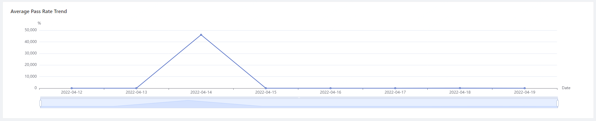

### areXTest Replays

- Visit arexTest replays
  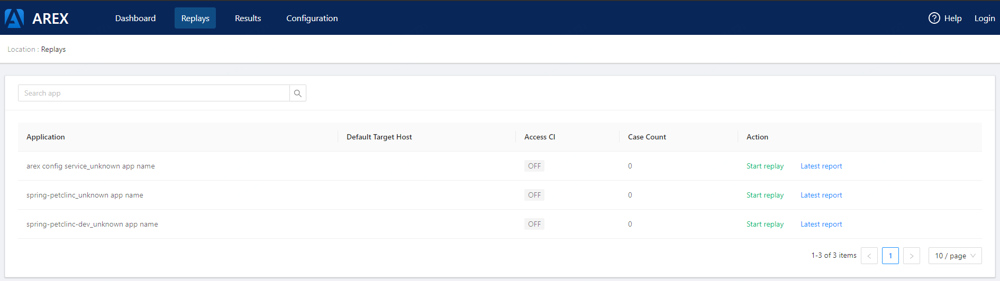
- Find your applications
- Click Action "start replay"
- Input you target host "http://10.3.2.237:8088/"
  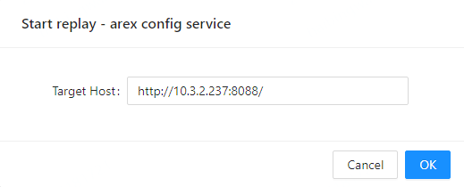
- Then, Visit the "latest report" to see you those test result.
  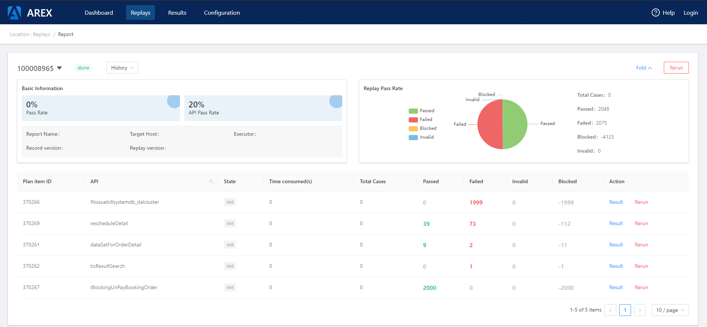
- The report include Base Information, Replay pass Rate and others. See the next topic.

### arexTest Reports

- Visit areXTest reports
  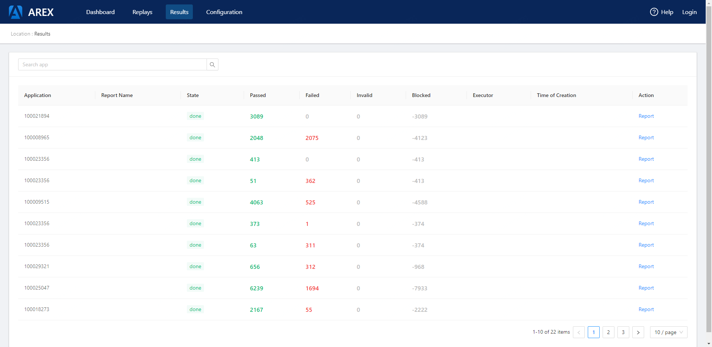
- Find your appication
- Or query your application by name
- Click the action "report" at the right side
- View your report detail (same as areXTest replays report)
- View TESTCASE information, such as State, Total Cases, Passed, Failed, Invalid, Block...
  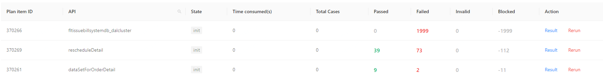
- Click "rerun" action, and you will run those TESTCASE again.
- Click "Result" to see what case failed
  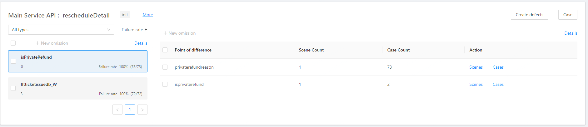
- The left area is displaying scenrio (Diff detail integrated by the same diff)
- The right area is displaying the scenrio's nodes whick has diffence
- Clicking the "Scenes" link, you will see the diff detail
  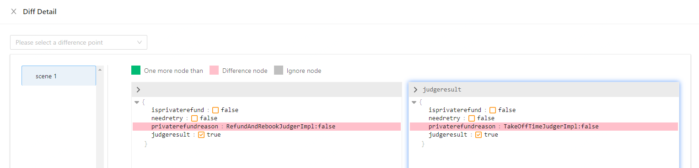
- Clicking the "Cases" link, you will see all cases about this replaying
  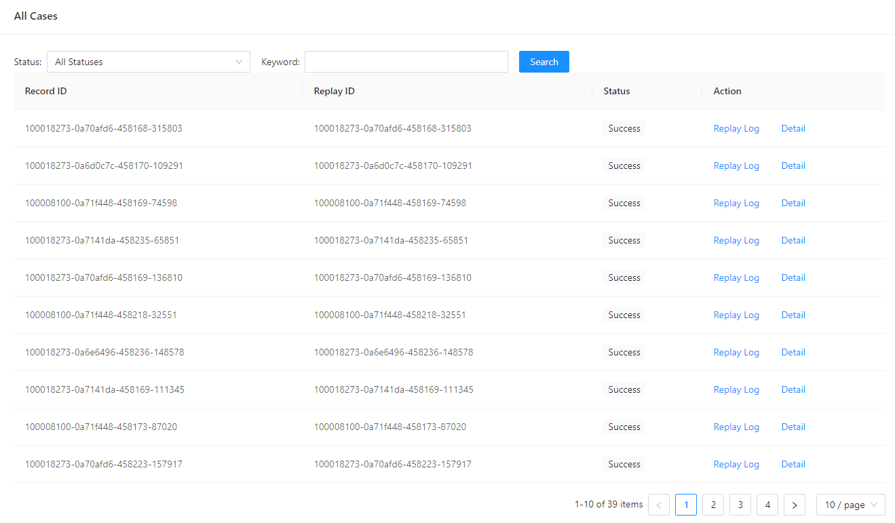
- Then, Clicking the "details", you will see the replaying logs and result.
  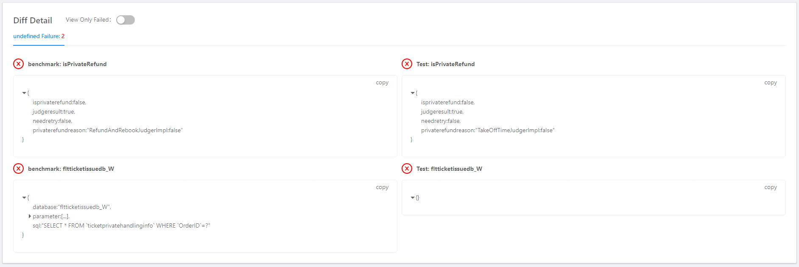
  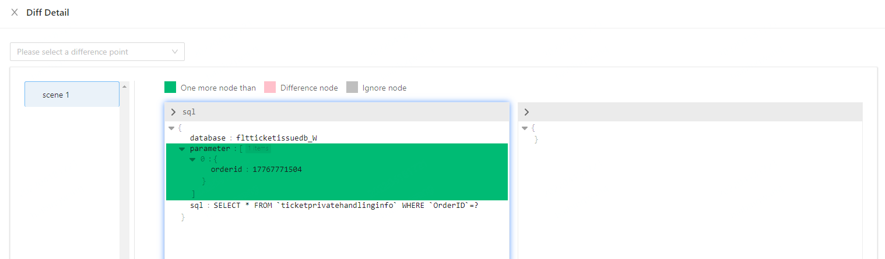

### areXTest configs

- Visit areXTest config
  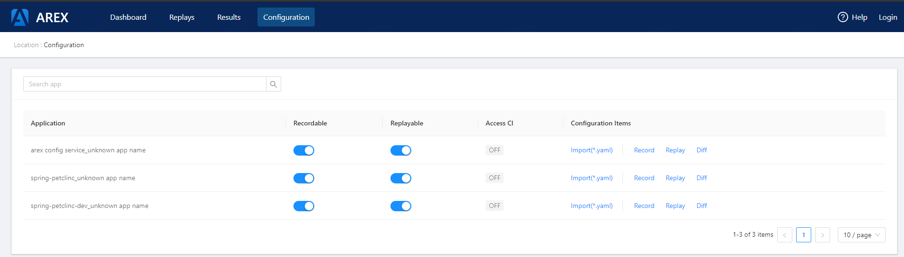
- Config application record options
  - config record basic options
    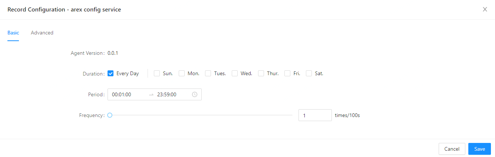
  - config record advance options
    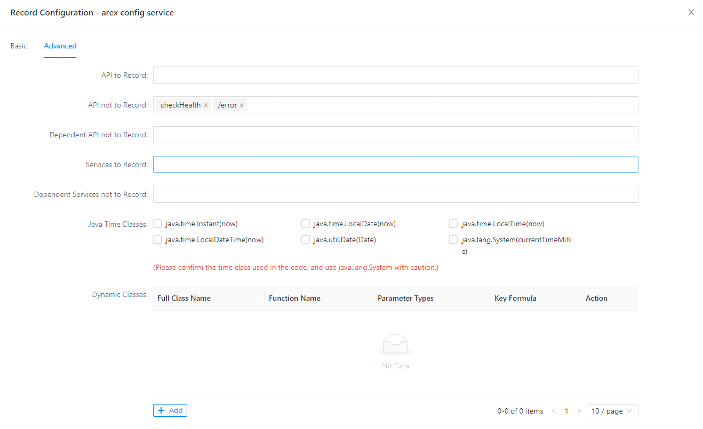
- Config application replay options
  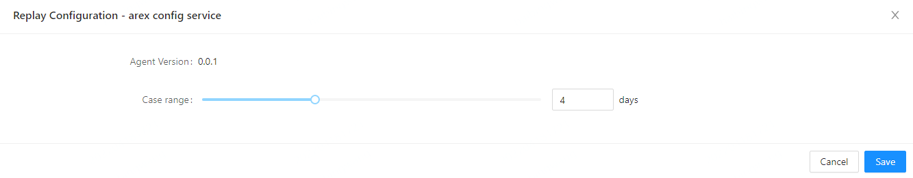
- Config application Diff options
  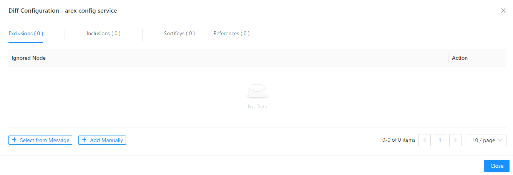
- Your cann import or export all Configration by YAML file
  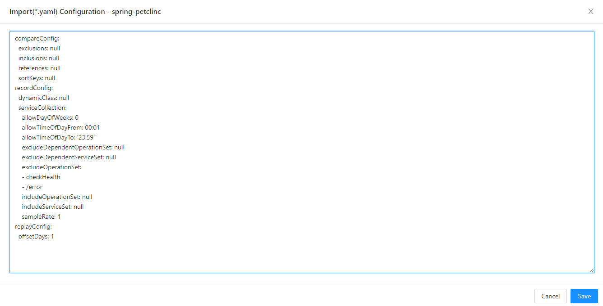

## Permissions

## Troubleshooting

## Developers

## Release notes

## API Reference

## Copyright notice
